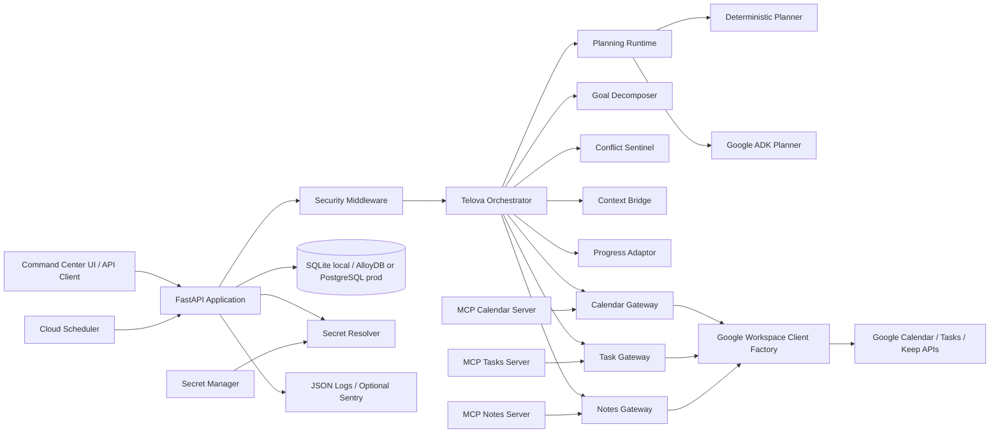
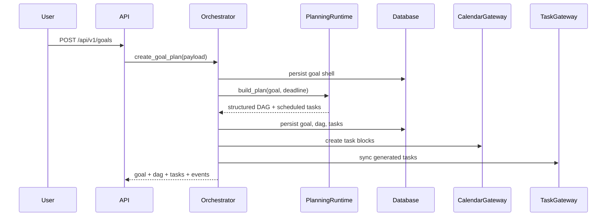
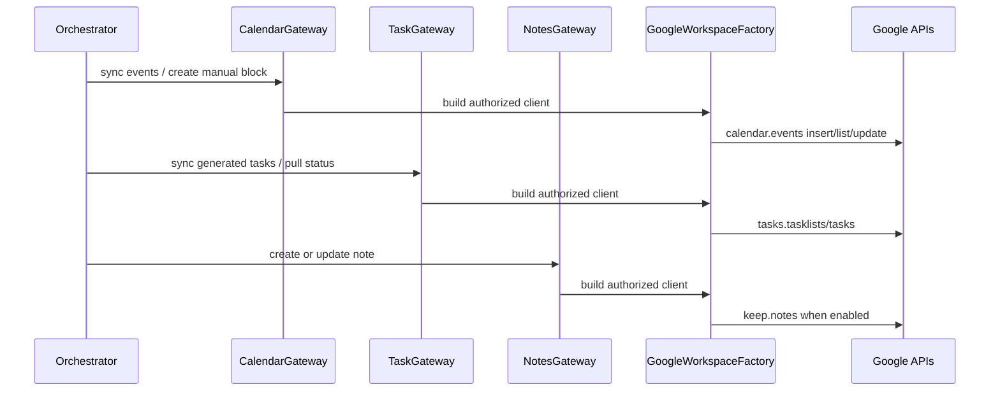
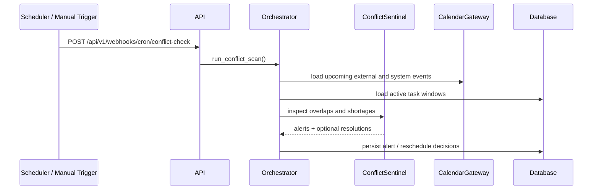
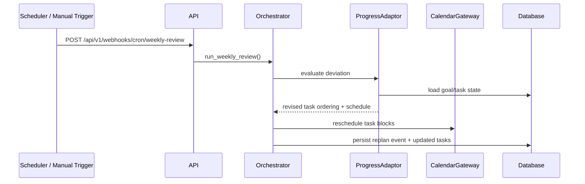

# Telova HLD + LLD

## 1. Product intent

Telova is a command-center style orchestration system for personal execution. A user gives the product a high-level goal, and Telova turns it into a dependency-aware plan, schedules the work, watches for conflict, stores working memory, and re-plans when execution slips.

## 2. Functional requirements

1. Accept a natural-language goal and optional deadline.
2. Generate a task DAG with milestones, sequencing, and suggested schedule windows.
3. Persist goals, tasks, calendar blocks, notes, context packages, and re-plan history.
4. Expose an API-first workflow plus a demo-ready command-center UI.
5. Support calendar, tasks, and notes tool surfaces through MCP-compatible entry points.
6. Detect near-term schedule conflicts and generate adaptation recommendations.
7. Sync generated artifacts to Google Calendar, Google Tasks, and optional Keep integrations.
8. Support deterministic local planning and optional Google ADK / Gemini orchestration.
9. Run securely in production with auth, rate limiting, structured logs, secret resolution, and migrations.
10. Deploy to Cloud Run with AlloyDB, Secret Manager, and Cloud Scheduler.

## 3. High-level architecture

## 4. Deployment topology

### Local development

- FastAPI runs in VS Code with SQLite by default.
- Deterministic planning runtime is the default so no external model credential is required.
- Calendar, task, and notes integrations can run in database mode for demo stability.
- The UI is served directly from the FastAPI static bundle.

### Production on GCP

- Cloud Run serves the FastAPI application.
- AlloyDB is the primary production persistence target.
- Secret Manager provides API keys, cron tokens, AlloyDB credentials, and Workspace credentials.
- Cloud Scheduler triggers conflict scans and weekly reviews through authenticated webhook calls.
- Google Workspace APIs back Calendar, Tasks, and optional Keep sync.
- The ADK runtime can use Gemini to improve decomposition while retaining deterministic fallback if unavailable.

## 5. UI topology

The frontend is structured as a desktop-first command center with these primary views:

1. Welcome / login
2. Dashboard
3. Goal creation
4. AI plan view
5. Calendar and schedule
6. Task board
7. Replan / adaptation
8. Notes and memory
9. API / system status

The UI follows a dark surface model with brand-led accent colors and persistent navigation, matching the product's control-room positioning.

## 6. Core runtime flows

### Goal creation and plan approval

### External sync and schedule reconciliation

### Conflict scan

### Weekly review and adaptation

## 7. Data model

### Goal

- `id`
- `user_id`
- `title`
- `description`
- `domain`
- `status`
- `deadline`
- `dag_json`
- `deviation`
- `created_at`
- `updated_at`

### Task

- `id`
- `goal_id`
- `user_id`
- `title`
- `description`
- `phase`
- `status`
- `depends_on`
- `estimated_minutes`
- `scheduled_start`
- `scheduled_end`
- `completed_at`
- `calendar_event_id`
- `external_task_id`
- `embedding`

### CalendarEvent

- `id`
- `user_id`
- `goal_id`
- `task_id`
- `title`
- `description`
- `source`
- `start_at`
- `end_at`
- `external_event_id`
- `metadata_json`

### Note

- `id`
- `user_id`
- `goal_id`
- `title`
- `content`
- `note_type`
- `external_note_id`
- `created_at`
- `updated_at`

### ContextPackage

- `id`
- `user_id`
- `from_goal_id`
- `to_goal_id`
- `summary`
- `created_at`

### ReplanEvent

- `id`
- `goal_id`
- `user_id`
- `reason`
- `payload_json`
- `created_at`

## 8. Module design

### `telova_api.config`

- Loads environment-driven configuration for runtime mode, Google integrations, auth, logging, Scheduler, and AlloyDB.

### `telova_api.secrets`

- Resolves values from direct env vars, mounted files, or Secret Manager.
- Keeps credential loading outside business logic.

### `telova_api.db`

- Creates the async SQLAlchemy engine and session factory.
- Supports SQLite, PostgreSQL URLs, and the AlloyDB Python connector.

### `telova_api.logging_utils`

- Configures JSON logging for Cloud Run compatible logs.

### `telova_api.monitoring`

- Wires optional Sentry instrumentation.

### `telova_api.security`

- Adds request ids, structured access logging, API auth, cron auth, and rate limiting.

### `telova_api.vectorizer`

- Provides deterministic hashed embeddings for local semantic search.
- Can be replaced later with pgvector or managed embedding services.

### `telova_api.repositories.*`

- Encapsulate aggregate persistence and external id lookups.
- Repository methods now support sync reconciliation against Google resources.

### `telova_api.services.planning_runtime`

- Abstraction over the planner implementation.
- Supports deterministic local planning and optional Google ADK orchestration.

### `telova_api.agents.goal_decomposer`

- Builds a normalized blueprint and scheduled DAG output.
- Reused by both deterministic and ADK-assisted runtimes.

### `telova_api.agents.conflict_sentinel`

- Scans near-term events for collisions, overload, and free-slot opportunities.

### `telova_api.agents.context_bridge`

- Creates operational summaries when the user switches context between goals.

### `telova_api.agents.progress_adaptor`

- Evaluates plan deviation and emits revised sequencing when the threshold is crossed.

### `telova_api.integrations.google_workspace`

- Builds Google API clients from authorized user creds, service account creds, or ADC.
- Centralizes delegated subject handling.

### `telova_api.integrations.calendar`

- Provides database mode and Google Calendar mode.
- Syncs Telova-managed task blocks and imports non-managed external events.

### `telova_api.integrations.tasks`

- Provides database mode and Google Tasks mode.
- Pushes generated tasks and pulls remote completion states.

### `telova_api.integrations.notes`

- Provides database mode and optional Google Keep sync.
- Falls back cleanly when Keep is disabled or unavailable.

### `telova_api.services.orchestrator`

- Primary coordination layer for all end-user and scheduler-triggered workflows.

### `telova_api.main`

- Wires FastAPI routes, middleware, startup lifecycle, static UI serving, and system readiness reporting.

### `alembic`

- Owns schema migration history for production promotion.

## 9. API surface

- `GET /`
- `GET /health`
- `GET /api/v1/dashboard`
- `GET /api/v1/goals`
- `POST /api/v1/goals`
- `GET /api/v1/goals/{goal_id}`
- `GET /api/v1/goals/{goal_id}/dag`
- `GET /api/v1/goals/{goal_id}/tasks`
- `POST /api/v1/goals/{goal_id}/switch`
- `PATCH /api/v1/tasks/{task_id}`
- `GET /api/v1/tasks`
- `GET /api/v1/tasks/search`
- `GET /api/v1/notes`
- `POST /api/v1/notes`
- `PATCH /api/v1/notes/{note_id}`
- `GET /api/v1/calendar/events`
- `POST /api/v1/calendar/events`
- `POST /api/v1/webhooks/cron/conflict-check`
- `POST /api/v1/webhooks/cron/weekly-review`
- `GET /api/v1/system/status`

## 10. Security, resilience, and operability

1. Datetimes are stored as timezone-aware UTC values.
2. Task status transitions are validated at the API boundary.
3. Completed tasks are never mutated during re-plan operations.
4. API routes can be protected with a shared API key.
5. Cron routes can be protected separately with a shared cron token.
6. Request throttling is enforced through in-process rate limiting.
7. Logs are structured for Cloud Run and optional error reporting via Sentry is available.
8. Readiness checks expose whether AlloyDB, Workspace auth, Secret Manager, ADK, and Scheduler are actually configured.

## 11. Deployment design

1. Develop locally with SQLite and deterministic planning.
2. Promote to AlloyDB or PostgreSQL using `alembic upgrade head`.
3. Enable `INTEGRATION_BACKEND=google` when Workspace credentials are ready.
4. Enable `AGENT_RUNTIME=google_adk` only after the ADK dependencies and model settings are installed.
5. Turn on `USE_SECRET_MANAGER=true` when the Cloud Run service account can access the required secrets.
6. Configure Cloud Scheduler jobs for conflict scans and weekly reviews.
7. Use the system status endpoint and UI to verify deployment readiness after release.
