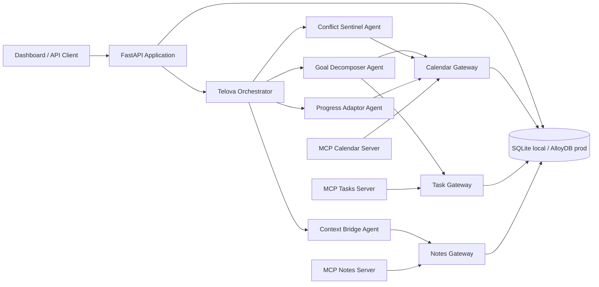
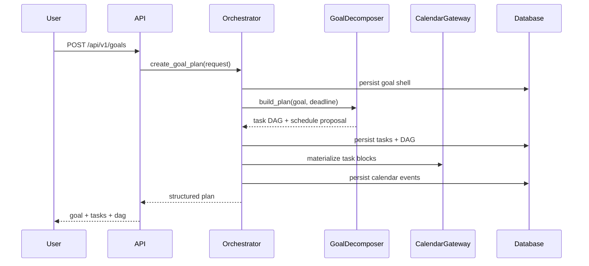
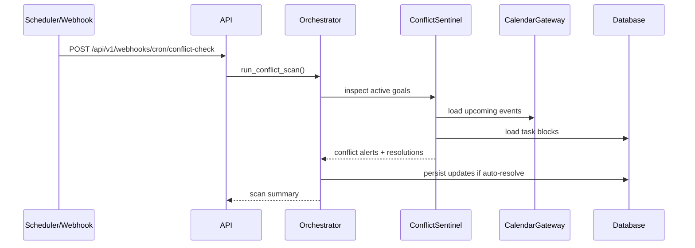
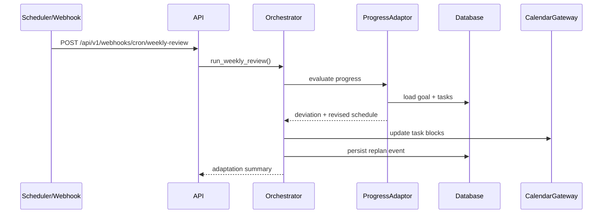

# Telova HLD + LLD

## 1. Product Intent

Telova converts a high-level goal into an execution system. Instead of asking the user to maintain a to-do list manually, the system plans the work, schedules it against time, detects conflicts ahead of time, and adapts the plan when execution drifts.

## 2. Functional Requirements

1. Accept a natural-language goal and optional deadline.
2. Build a dependency-aware task graph.
3. Persist goals, tasks, schedules, notes, and re-plan history.
4. Expose an API-first workflow.
5. Provide calendar, task, and notes tool surfaces through MCP-compatible entry points.
6. Detect near-term schedule conflicts.
7. Generate context packages when switching goals.
8. Re-plan goals when progress deviation crosses a threshold.
9. Support local development now and GCP deployment later.

## 3. High-Level Architecture

## 4. Deployment Topology

### Local development

- FastAPI app runs with SQLite.
- MCP servers run as separate local Python processes if needed.
- Dashboard talks to the API directly.

### Production on GCP

- FastAPI app deploys to Cloud Run.
- Cloud Scheduler calls cron endpoints for conflict scans and weekly reviews.
- Database shifts to AlloyDB PostgreSQL.
- Tool adapters switch from DB-backed local implementations to Google-backed integrations.
- Secrets move to Secret Manager.

## 5. Core Runtime Flows

### Goal creation

### Conflict detection

### Weekly adaptation

## 6. Data Model

### Goal

- `id`: unique identifier
- `user_id`: tenant key
- `title`: natural language goal title
- `description`: optional detail
- `domain`: classified planning domain
- `status`: active, paused, completed
- `deadline`: target finish date
- `dag_json`: persisted DAG representation
- `deviation`: latest progress deviation

### Task

- `id`
- `goal_id`
- `user_id`
- `title`
- `description`
- `phase`
- `status`
- `depends_on`
- `estimated_minutes`
- `scheduled_start`
- `scheduled_end`
- `completed_at`
- `calendar_event_id`
- `embedding`

### CalendarEvent

- `id`
- `user_id`
- `goal_id`
- `task_id`
- `title`
- `source`: `system` or `external`
- `start_at`
- `end_at`
- `metadata_json`

### Note / Context Package / ReplanEvent

- Notes store structured summaries.
- Context packages capture goal-switch briefings.
- Replan events preserve plan history and adaptation reasons.

## 7. Module Design

### `telova_api.config`

- Loads environment-driven runtime settings.
- Centralizes threshold and timezone configuration.

### `telova_api.db`

- Creates the async SQLAlchemy engine and session factory.
- Initializes tables on startup.

### `telova_api.vectorizer`

- Implements deterministic hashed embeddings for local semantic search.
- Can be replaced by AlloyDB pgvector in production.

### `telova_api.repositories.*`

- Encapsulate persistence logic per aggregate.
- Keep agent logic free from raw SQL and HTTP concerns.

### `telova_api.services.scheduling`

- Finds available time windows while respecting busy events.
- Used by planning, conflict resolution, and re-planning.

### `telova_api.agents.goal_decomposer`

- Classifies the goal into a planning domain.
- Builds task blueprints with dependencies.
- Produces scheduled tasks and a DAG payload.

### `telova_api.agents.conflict_sentinel`

- Scans the next time window for overlapping external and system events.
- Produces suggested or auto-applied resolutions.

### `telova_api.agents.context_bridge`

- Summarizes open work when the user switches from one goal to another.
- Persists a note and a context package record.

### `telova_api.agents.progress_adaptor`

- Calculates deviation from plan.
- Reschedules pending work when the threshold is exceeded.
- Emits a re-plan event for traceability.

### `telova_api.services.orchestrator`

- Primary coordination layer.
- Owns goal creation, scan execution, context switching, and weekly review flows.

### `telova_api.mcp_servers.*`

- Expose calendar, task, and notes capabilities via MCP for hackathon alignment.

## 8. API Surface

- `GET /health`
- `GET /`
- `GET /api/v1/dashboard`
- `GET /api/v1/goals`
- `POST /api/v1/goals`
- `GET /api/v1/goals/{goal_id}`
- `GET /api/v1/goals/{goal_id}/dag`
- `POST /api/v1/goals/{goal_id}/switch`
- `PATCH /api/v1/tasks/{task_id}`
- `GET /api/v1/tasks/search`
- `GET /api/v1/calendar/events`
- `POST /api/v1/calendar/events`
- `POST /api/v1/webhooks/cron/conflict-check`
- `POST /api/v1/webhooks/cron/weekly-review`

## 9. Validation and Error Handling

1. Datetimes are stored as timezone-aware UTC values.
2. Deadline defaults are generated if the user omits them.
3. Task status transitions are validated at the API boundary.
4. Conflict detection ignores unrelated users.
5. Re-planning never mutates completed tasks.

## 10. Production Upgrade Path

1. Replace SQLite with AlloyDB by changing `DATABASE_URL`.
2. Move local embeddings to pgvector or AlloyDB AI embedding functions.
3. Replace DB-backed tool adapters with Google Calendar and Google Tasks adapters.
4. Wire Secret Manager and Cloud Scheduler.
5. Optionally wrap the deterministic planners with Gemini/ADK prompts for richer decomposition.

